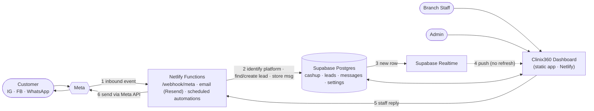
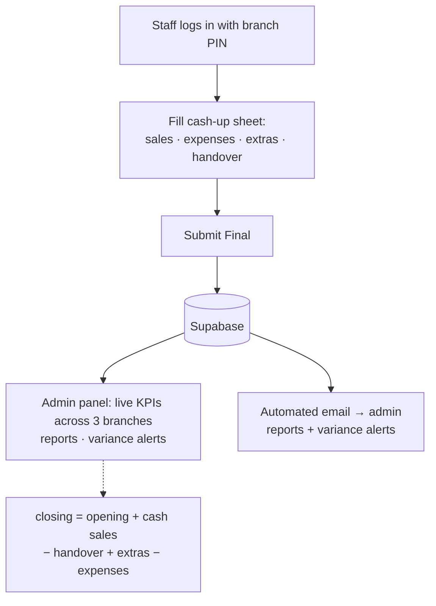
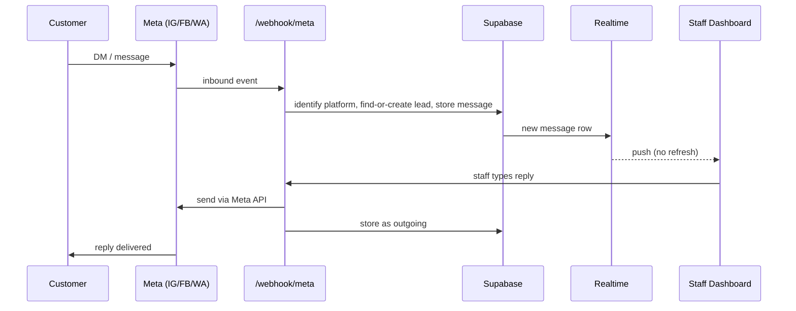
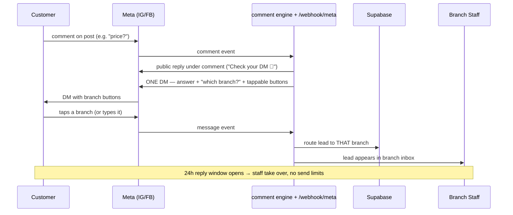
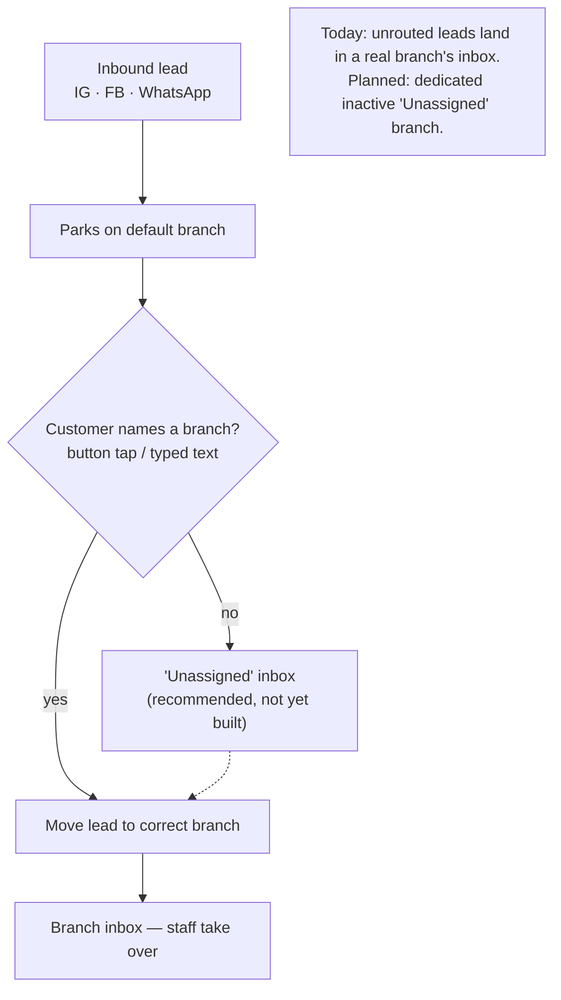

# Clinix360 — Backend Flow Diagrams

*Companion to [BACKEND_FLOWS_MEETING_BRIEF_2026-08-05.md](BACKEND_FLOWS_MEETING_BRIEF_2026-08-05.md). View in VSCode/GitHub markdown preview to render the Mermaid.*

---

## 0. Architecture — the pieces and how they connect

One app, one database, one webhook. Three platforms (IG · FB · WhatsApp) all feed the same `/webhook/meta` endpoint; the code routes by event.

---

## Flow A — Daily Cash-up (live since day one)

---

## Flow B — Unified Lead Inbox (IG · FB · WhatsApp)

One inbound path, one reply path, three platforms. The realtime push is what makes it feel live.

---

## Flow C — Comment Automation (IG + Facebook)

The "comment PRICE and I'll DM you" mechanic. One DM per comment — ending on a question turns a one-shot broadcast into a conversation *and* solves branch routing.

Keyword rules are admin-editable in Settings (one shared list for IG + FB).

---

## Flow D — Branch Routing (the cross-cutting piece)

Every inbound lead starts on one default branch, then moves to the correct branch the moment the customer names one — across all three platforms.

